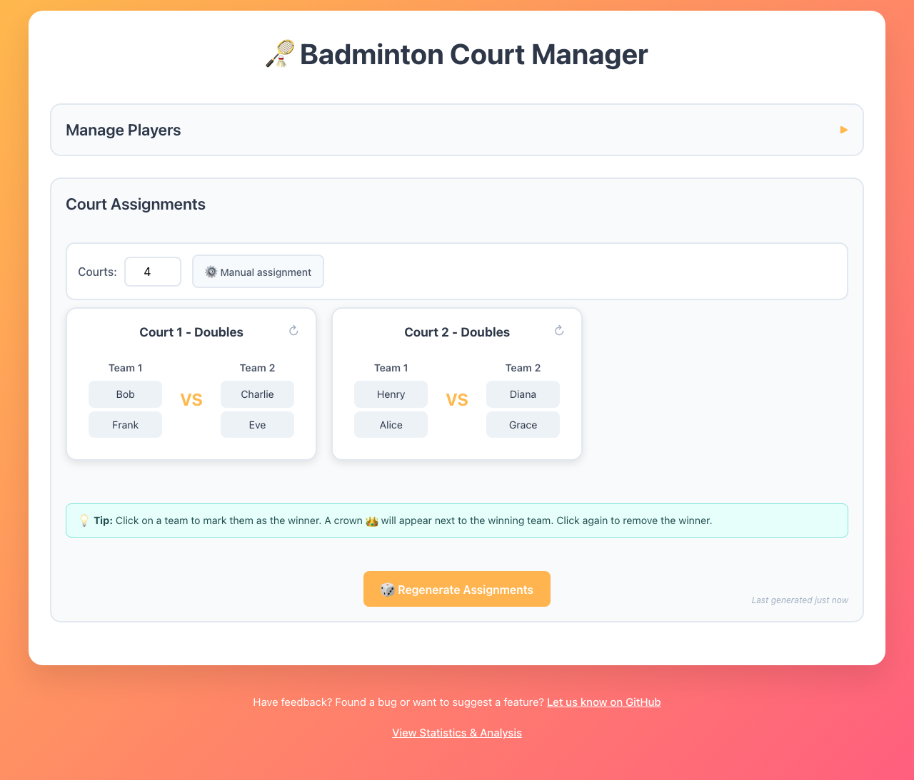

# 🏸 Badminton Court Manager

A React TypeScript application that helps organize badminton players into court assignments using manual or image-based player list extraction.

[**Try the app**](https://sylhare.github.io/Badminton/)

## Features

- **📸 Image Upload & OCR**: Take a picture of a player list and automatically extract names using Tesseract.js
- **✍️ Manual Player Entry**: Add players manually - one at a time or multiple at once
- **👥 Player Management**: Toggle player presence, remove players
- **🏆 Optimised Court Assignment**: Automatically assigns players to courts using a cost-based engine that maximises fairness over time
  - Doubles (4 players) preferred
  - Singles (2 players) for odd numbers
  - Automatic bench assignment for extra players
- **🔄 Team Rotation**: Rotate team compositions on a court without reshuffling everyone
- **📱 Responsive Design**: Works on desktop and mobile devices

## Algorithm

The engine assigns players to courts by minimising a cost function across these rules:

1. **Bench rotation fairness** – players who have sat out more often get priority to play next.
2. **Singles match rotation fairness** – players who have played fewer singles matches get priority.
3. **Partner variety** – players who have already been teammates many times are less likely to be paired again.
4. **Opponent variety** – players who have faced each other frequently are less likely to be opponents again.
5. **Balanced matches** – wins and losses are spread so teams stay competitive (no "super teams" or weak pairings).
6. **Proper game formats** – courts always have either singles (2) or doubles (4), never 3 players.
7. **Optimal team pairings** – for each doubles match, the system tries all possible team splits and picks the fairest.

See [`analysis/`](analysis/README.md) for simulation scripts and benchmarks.

## Contributing

See [`.github/CONTRIBUTING.md`](.github/CONTRIBUTING.md) for development setup and available scripts.

## License

[AGPL-3.0](LICENSE) © sylhare
